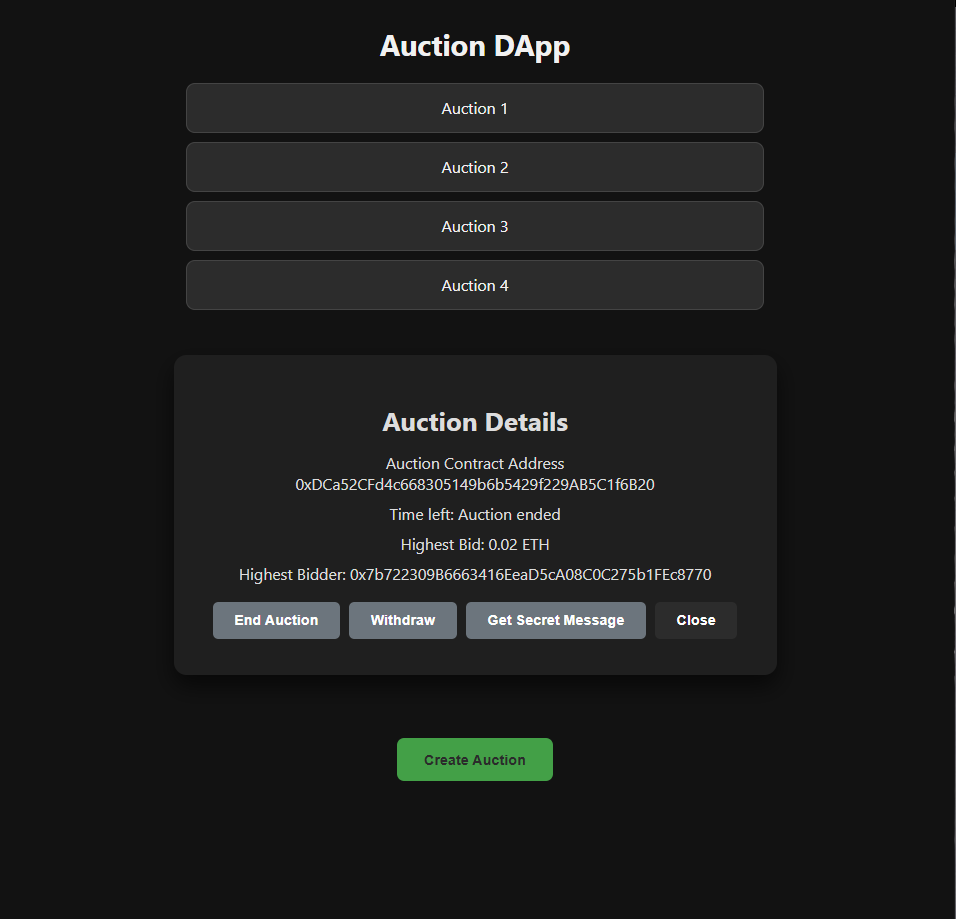
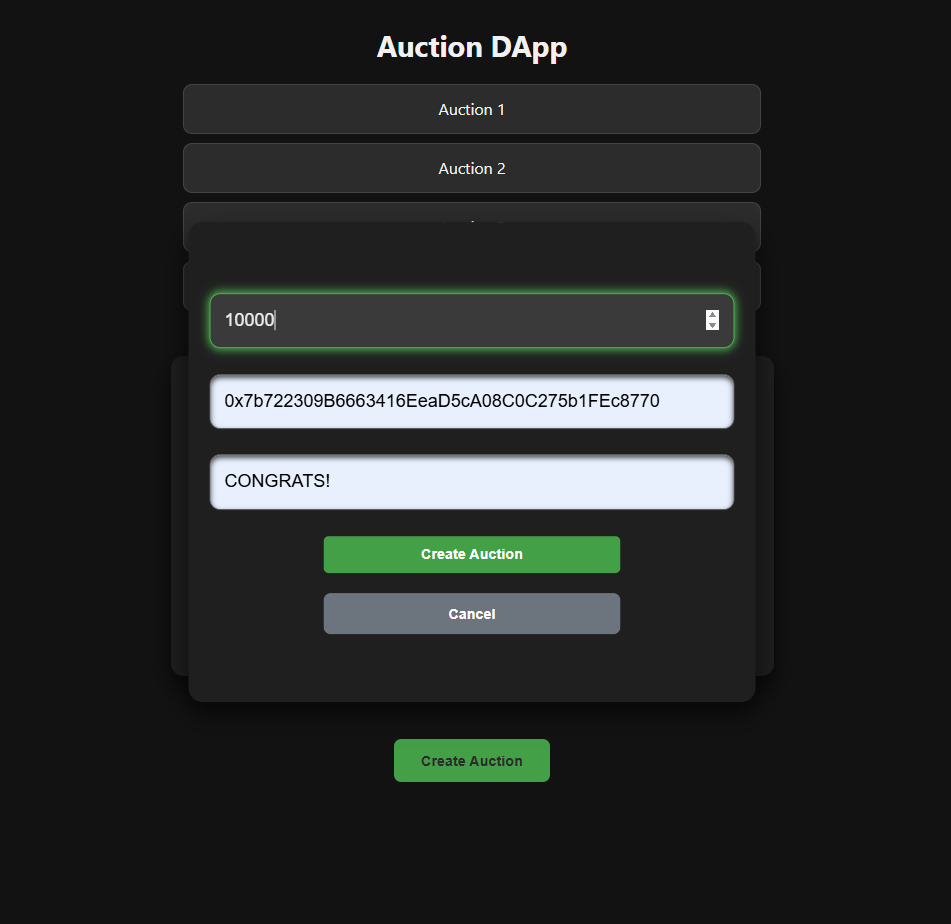
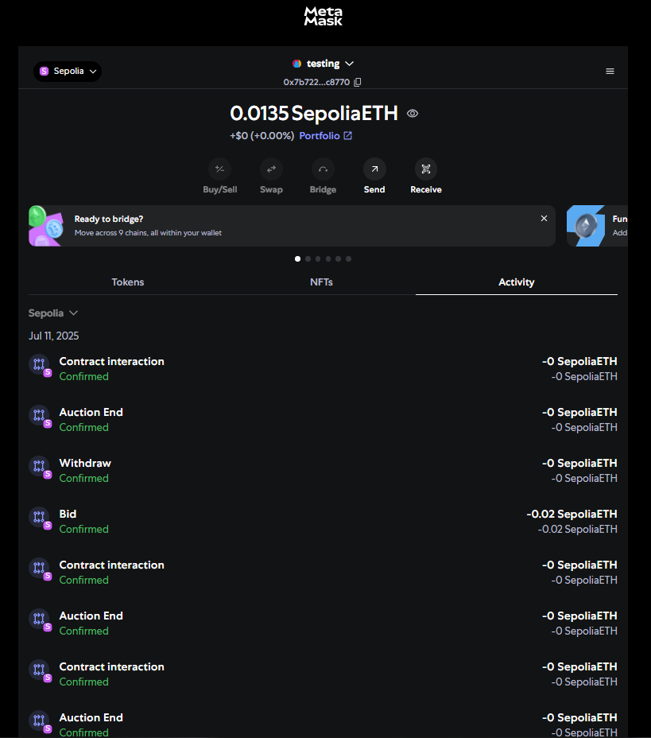
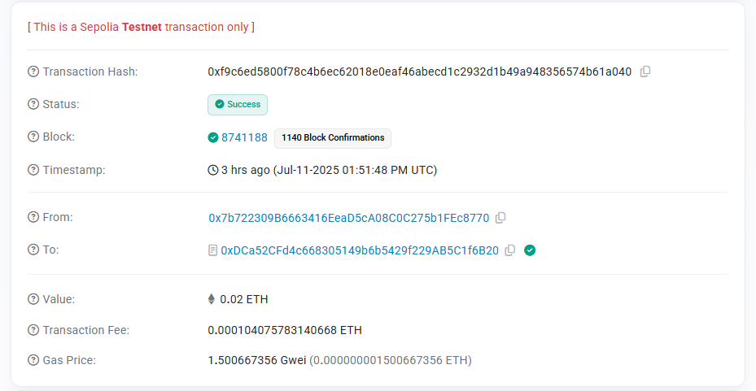

# Auction DApp

> Developed as part of **Blockchain Bootcamp 2024**  

> 
A decentralized auction platform where users can create and participate in ETH-based auctions on the Ethereum Sepolia testnet. Built with Solidity smart contracts, Web3.js and React frontend.

---

## Features

- Create new auctions with a bidding time, beneficiary address and secret message
- View list of active auctions
- Place bids in ETH using MetaMask
- Real-time highest bid and highest bidder display
- End auction once the bidding period expires
- Withdraw funds for non-winning participants
- View secret message (only for the winner)

---

## Tech Stack

| Technology     | Role |
|----------------|------|
| **Solidity**   | Smart contract logic (Auction contract) |
| **React.js**   | Frontend interface |
| **Web3.js**    | Blockchain interaction (ETH transactions, contract calls) |
| **MetaMask**   | Wallet integration for signing and sending transactions |
| **Sepolia**    | Ethereum testnet used for deployment and testing |
---
## Screenshots

| Auction Details | Create Auction |
|----------------|-----------------|
|  |  |

---

## Transactions & Blockchain Proof

| MetaMask (Bid Confirmation) | Etherscan (0.02 ETH bid) |
|-----------------------------|--------------------------|
|  |  |

---
